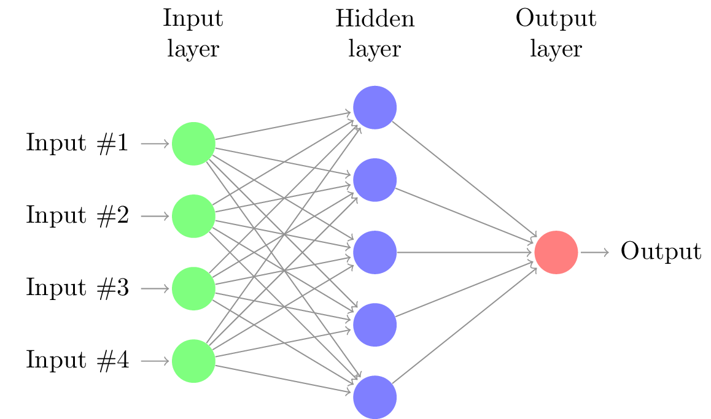
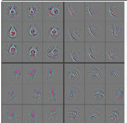

```{r setup, include=FALSE}
options(htmltools.dir.version = FALSE)
knitr::opts_chunk$set(fig.retina = 3, warning = FALSE, message = FALSE, echo = FALSE)
```

```{r xaringan-themer, include=FALSE, warning=FALSE}
library(xaringanthemer)
style_mono_accent(
  base_color = "#003d73",
#  header_font_google = google_font("Josefin #Sans"),
  header_font_google = google_font("Oswald"),
  text_font_google   = google_font("Roboto", "300", "300i"),
  code_font_google   = google_font("Fira Mono"),
  
)


style_extra_css(
  css = list(
    ".fade" = list(opacity = "0.5"),
    hr = list(content = "",
              display = "block",
              border = "none",
              "background-color" = "#EB811B",
              color = "#EB811B",
              height = "1px"
              ),
    brlong = list(display = "block",
                  content = '""',
                  "margin_top" = "250")
  )
)

```

```{r xaringanExtra, echo=FALSE}
xaringanExtra::use_xaringan_extra("tile_view")

pacman::p_load(knitr, showtext, ggplot2)

font_add_google("Oswald", "Oswald")
showtext_auto()
theme_set(theme_minimal(base_size = 22, base_family = "Oswald"))


```

class:  middle, title-slides

<h1 style="margin-bottom: 0;"> Introduction to Machine Learning </h1>

<hr>
<hr style="height:2pt; visibility:hidden;" />

![:col_row_title 
  <i class="fas fa-user" aria-hidden="true" style="color:#003d73"></i>  Lasse Hansen<hr style="height:0.5pt; visibility:hidden;" /><i class="fas fa-envelope" aria-hidden="true" style="color:#003d73"></i><a href = "mailto: lasse.hansen@clin.au.dk"> lasse.hansen@clin.au.dk</a>, 
  <i class="fa fa-map-marker-alt" aria-hidden="true" style="color:#003d73"></i> ADA Journal Club<hr style="height:0.5pt; visibility:hidden;" /><i class="fa fa-calendar-alt" aria-hidden="true" style="color:#003d73"></i> 25 May 2021, 
  ]


---
class: inverse, center, middle

# Terminology


---
class: center, middle

```{r out.height="500px"}

```


???
- the pop-sciency way of showing it
- logistic/linear regression are in the ML department
- Not how the terms are used by practioners
- why now? VAST AMOUNTS OF DATA
---

class: center, middle

```{r  out.height="500px"}

```


---

class: inverse, middle, center

# Rule-based Models


---

### Rule-based Models


.left-column[
```{r out.height="500px"}

```
]

.right-column[
.large[Flowcharts and decision trees based on *__expert knowledge__* or *__learned from data__*.]

]


???
- clinical scoring scales are also an example

---

### Rule-based Models


.left-column[
```{r out.height="500px"}

```
]

.right-column[
.large[Flowcharts and decision trees based on *__expert knowledge__* or *__learned from data__*.]

```{r fig.align="center", out.width="500px"}

```
]


???
- diabetes prediction based on blood glucose levels, insulin response etc.

---


class: inverse, middle, center

# Classic Machine Learning


---

### Classic Machine Learning

.left-column[
```{r out.height="500px"}

```
]

.right-column[
.large[Models that learn from *__structured features__* such as what you find in the 
*__SFIs__* in the EHRs. ]

]


???
- height, weight, BMI, diagnoses, medicine taken, lab tests
- primarily tabular data

---

### Classic Machine Learning

.left-column[
```{r out.height="500px"}

```
]

.right-column[
.large[Models that learn from *__structured features__* such as what you find in the *__SFIs__* in the EHRs. ]

```{r fig.align="center", out.width="500px"}

```
]


???
- logistic/linear regression not shown here, but falls under the umbrella
- can easily deal with non-linearity


---

class: inverse, middle, center

# Representation/Deep Learning


---

### Representation Learning

.left-column[
```{r out.height="500px"}

```
]

.right-column[
.large[Models *__create their own representation__* from raw input data]

]


???
- what does this mean? an example from CV

---

### Representation Learning

.left-column[
```{r out.height="500px"}

```
]

.right-column[
.large[Models *__create their own representation__* from raw input data]

```{r fig.align="center", out.width="300px"}

```

]


???
- classical way: algorithmic segmentation -> ML model
- learn features on its own! but how?

---

class: inverse, center, middle

# Neural Network Foundations


---

### Neural Network Foundations


.large[Multiple layers of *__non-linear__* processing]

```{r fig.align="center", out.width="600px"}

```


???
- multiple layers densely connected units
- input units take a pixel, word, SFI
- all units feed to the next where a non-linear function is applied to the weighted sum. This goes on for multiple layers until the output


---

### Neural Network Foundations

<br>

.pull-left[

```{r fig.show="hold", fig.align="right", out.width="50%"}

```

]

.pull-right[
```{r fig.show="hold", fig.align="left", out.width="50%"}

```

]


---

### Neural Network Foundations

<br>

.pull-left[

```{r fig.show="hold", fig.align="right", out.width="50%"}

```

]

.pull-right[
```{r fig.show="hold", fig.align="left", out.width="50%"}

```

]


???
transfer learning

---
class: inverse, center, middle

# Natural Language Processing

---
### Natural Language Processing

.large[Computers don't like working text. We need to convert it to numbers somehow.

Solution? Word vectors.
]

```{r fig.align="center", out.width="25%"}
knitr::include_graphics("imgs/nlp_vis.png")
```


---
### Handcrafted Word vectors

.pull-left[
> it was the best of times

> it was the worst of times

> it was the age of wisdom

> it was the age of foolishness
]

.pull-right[
```{r echo=FALSE}
library(tm)
library(tidyverse)
library(knitr)
library(kableExtra)

text = c("it was the best of times",
                        "it was the worst of times",
                        "it was the age of wisdom",
                        "it was the age of foolishness")

corps = SimpleCorpus(VectorSource(text), control = list(language="dk"))
DocumentTermMatrix(corps, control = list()) %>% 
  as.matrix() %>% 
  as_tibble() %>%  
  kbl() %>% 
  kable_classic()

```
]

???
- Could also be word co-occurence, weighted by frequency of words etc.


---
### Handcrafted Word vectors

.pull-left[
> it was the best of times

> it was the worst of times

> it was the age of wisdom

> it was the age of foolishness


<br>

.large[
Context and semantics are completely disregarded!

Instead, train a deep learning model to learn *__contextualized word vectors__*
]


]

.pull-right[
```{r echo=FALSE}
library(tm)
library(tidyverse)
library(knitr)
library(kableExtra)

text = c("it was the best of times",
                        "it was the worst of times",
                        "it was the age of wisdom",
                        "it was the age of foolishness")

corps = SimpleCorpus(VectorSource(text), control = list(language="dk"))
DocumentTermMatrix(corps, control = list()) %>% 
  as.matrix() %>% 
  as_tibble() %>%  
  kbl() %>% 
  kable_classic()

```
]

---

### BERT

```{r fig.align="center", out.width="60%"}
knitr::include_graphics("imgs/bert.png")
```

???
trained to find the masked item on hugo corpora
learns general structure of the language
essentially just a complex way of turning words into vectors of number
these vectors can be fed to any classifier

---
class: inverse, middle, center

# Take Home Messages

---
### Take Home Messages

.left-column[
### Machine Learning

]

.right-column[
- Learning from *__handcrafted features__*
- Encompasses a wide range of models, and very useful for most tasks
- Does not handle complex tasks like image or text analysis very well

]

---
### Take Home Messages

.left-column[
### Machine Learning

### Deep Learning
]

.right-column[
.fade[- Learning from *__handcrafted features__*
- Encompasses a wide range of models, and very useful for most tasks
- Does not handle complex tasks like image or text analysis very well]

<br>

- Creates meaningful features from raw input by itself
- Requires a lot of training data
- Very powerful, but can overfit if not careful
]

---
### Take Home Messages

.left-column[
### Machine Learning

### Deep Learning

### NLP
]

.right-column[
.fade[- Learning from *__handcrafted features__*
- Encompasses a wide range of models, and very useful for most tasks
- Does not handle complex tasks like image or text analysis very well

<br>

- Creates meaningful features from raw input by itself
- Requires a lot of training data
- Very powerful, but can overfit if not careful]

- How to turn text into meaningful representations for computers
- BERT learns *__contextualised word representations__* 
- *__Transfer learning__* is key to the success of deep learning and NLP
]


---
class: inverse, center, middle

# Questions?


???
Interpretability?

Did not mention:
- Overfitting
- Interpretatability


```{r echo=FALSE}

library(stringr)
#f <- str_replace(rstudioapi::getSourceEditorContext()$path, ".Rmd", ".html")

#pagedown::chrome_print(f)


```


```{r}
library(tidyverse)
sigmoid <- function(x) 1/(1+ exp(-x))

vals <- seq(-5, 5, 0.1)

trans <- lapply(vals, sigmoid)
trans
```

